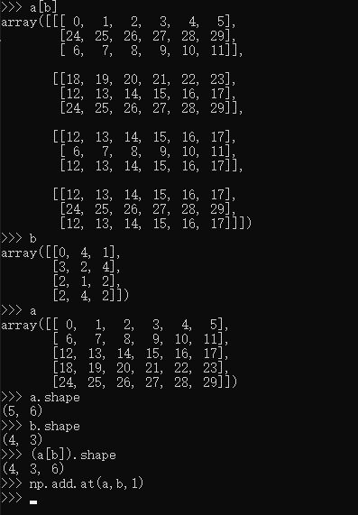

# 作业一
# 作业二

1. relu梯度，在0时应该是0.5，大于0是1，小于0是0
2. 网络中w初始化，在网络结构不深是，初始化的std小一些；在网络结构深的时候，随机化std大一些，免得梯度丢失
3. learning rate设置中，可以参考课件中的一个曲线图，根据loss的曲线判断lr设置大了还是小了
4. batchnorm中batchnorm_backward与batchnorm_backward_alt区别
5. 在batch norm中，发现n=2时，梯度不匹配很高，检查发现，在n=1时，梯度为0，n=2时，梯度很小（在10e-7的量级），如果diff在10e-8的量级时，精度差为10e-13等，怀疑float达不到这样的精度
6. 关于pytorch中最后一个达不到55（如果初始化的话），[网上给出的解释](https://discuss.pytorch.org/t/weight-initialization-with-a-custom-method-in-nn-sequential/24846/2)
7. 关于np.add.at问题（assignment3,rnn_layer.py中word_embedding_backward函数），[stackoverflow链接](https://stackoverflow.com/questions/45473896/np-add-at-indexing-with-array),这个不怎么好理解，但是np.add.at(dW,x,dout)中，dW，x会形成一个三维数组，dW[x],这个与word_embedding_forward函数相对应，应该会帮助理解

# todo

1. 实现batchnorm_backward_alt 现在仅仅是copy